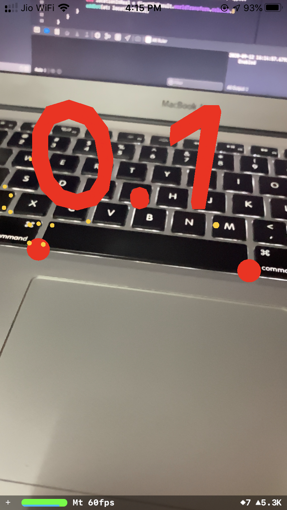

#  AR Ruler
An iOS Application which measures distance in Real World.

 This application is part of <a href="https://www.udemy.com/course/ios-13-app-development-bootcamp/">iOS Application Bootcamp</a> course by Dr. Angela Yu, <a href="https://www.appbrewery.co">TheAppBrewery</a>.

## Screenshots

## Technologies
- Swift Programming Language
- Storyboard 
- UIKit - UIViewController 
- SceneKit - SCNNode | SCNDebugOptions | SCNSphere | SCNMaterial | SCNVector3 | SCNScene | SCNText
- ARKit - ARSession | ARSCNViewDelegate | ARSCNView | ARConfiguration | ARHitTestResult
- UITouch
- simd_float4
